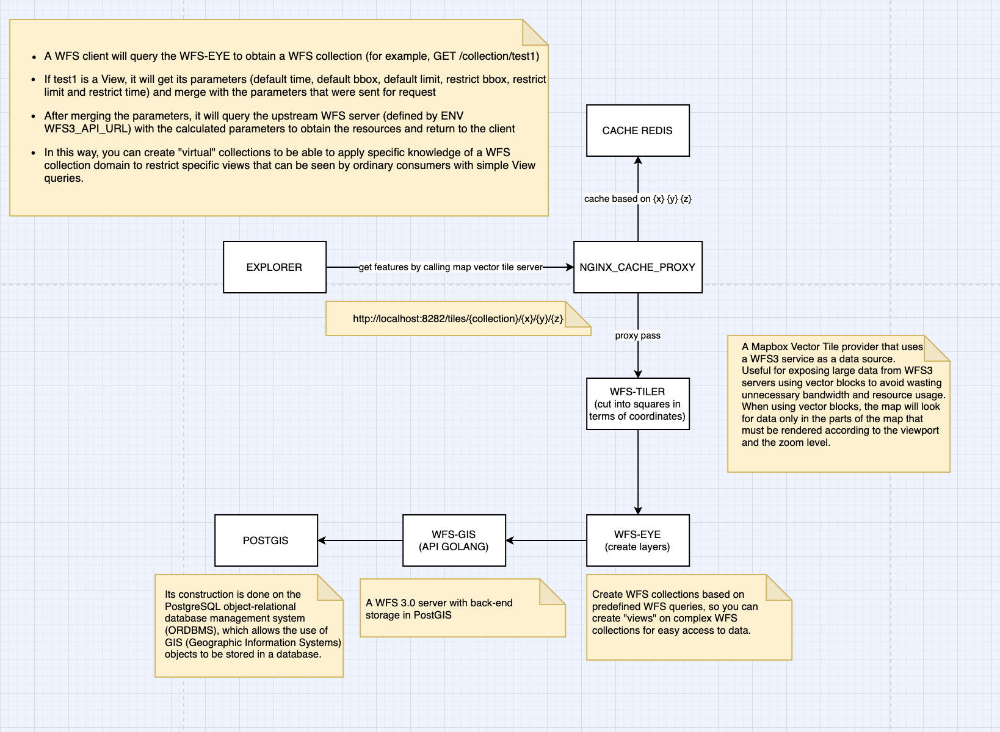

# wfs-eye

[](https://hub.docker.com/r/flaviostutz/wfs-eye)<br/>
[](https://goreportcard.com/report/github.com/flaviostutz/wfs-eye)

Create WFS collections that are based on pre defined WFS queries so that you can create "views" over complex WFS collections to easy data access.

```
[ WFS CLIENT ] --> [ WFS-EYE ] --> [ WFS 3.0 SERVER ]
```

  * A WFS client will query WFS-EYE for a WFS collection (for example, GET /collection/test1)
  * If test1 is a View, it will get its parameters (default time, default bbox, default limit, restrict bbox, restrict limit and restrict time) and merge with parameters that were sent to request
  * After merging the parameters, it will query the upstream WFS server (defined by ENV WFS3_API_URL) with the computed parameters to get the features and return to the client
  * By this way, you can create "virtual" collections so that you can apply a specific knowledge of a WFS collection domain to restrict specific views that can be seen by ordinary consumers with simple queries to the View.

## Usage

* Create docker-compose.yml file

```yml
version: '3.7'
services:
  wfs-eye:
    image: flaviostutz/wfs-eye
    ports:
      - 4000:4000
    restart: always
    environment:
      - WFS3_API_URL=http://wfsgis:8080
      - MONGO_ADDRESS=mongo
      - MONGO_USERNAME=root
      - MONGO_PASSWORD=root
      - LOG_LEVEL=debug

  mongo:
    image: mongo:4.1.10
    environment:
      - MONGO_INITDB_ROOT_USERNAME=root
      - MONGO_INITDB_ROOT_PASSWORD=root
    ports:
      - 27017-27019:27017-27019

  wfsgis:
    image: flaviostutz/wfsgis
    ports: 
      - 8080:8080
    restart: always
    environment:
      - POSTGRES_HOST=postgis
      - POSTGRES_USERNAME=admin
      - POSTGRES_PASSWORD=admin
      - POSTGRES_DBNAME=admin

  postgis:
    image: mdillon/postgis:11-alpine
    ports:
      - 5432:5432
    environment:
      - POSTGRES_USER=admin
      - POSTGRES_PASSWORD=admin
      - POSTGRES_DB=admin
```

* Run "docker-compose up"

* Create view with

```shell
curl -X POST \
  http://localhost:4000/views \
  -d '{
	"name": "testview1",
	"collection": "tests",
	"defaultTime": "2019-02-01/",
	"maxTimeRange": "2019-01-01/2019-04-30",
	"defaultLimit": 200,
	"maxLimit": 500,
	"defaultBbox": [-45,-15,-44,-14],
	"maxBbox": [-50,-20,-40,-10],
  }
'
```

* Query the view as you would in a regular WFS query to a collection

```shell
curl -X GET \
  http://localhost:8080/collections/testview1/items \
```

* In this query, wfs-eye will query the WFS server with http://wfsgis:8080/collections/tests/items because it will add the view default values to time and bbox.


## View API

  * **POST /views**
    * Creates a new View
    * Body: json
        * "name": name of the view to be used as a "collection" name during WFS calls
        * "collection": target collection name on WFS server that contains geometries. If you use a name of another View in this field, it will be computed, layer by layer, until one is not a View, but a real collection. This way you can create various recurrent Views, one on top of another.
        * "defaultTime": if a "time" query param is not included in WFS query, add this value to upstream WFS
        * "maxTimeRange": the time param for upstream WFS won't be outside theses limits. If the query comes with a value outside this range, it will be clipped
        * "defaultLimit": if the "limit" query is not passed, use this value on upstream WFS
        * "maxLimit": limit the "limit" query param to this value before calling upstream WFS
        * "defaultBbox": if "bbox" param is not passed, use this one
        * "maxBbox": limit "bbox" boundaries to this value, clipping if necessary before calling upstream WFS
        * "defaultFilterAttr": add those filter attributes to que upstream WFS by default

  * **PUT /views/[view name]**
    * Updates a view
    * Body: json with view contents (same as above)

  * **GET /views**
    * List all views
    * Body: json array with view contents (same as above)

  * **GET /views/[view name]**
    * Gets a specific view
    * Body: json with view contents (same as above)

  * **DELETE /views/[view name]**
    * Deletes a view


## WFS 3.0 API

  * wfs-eye will respond to regular WFS 3.0 queries at /collection/[collection name]
  * If collection-name matches an existing View name, it will use the definition on this view before calling the target WFS server (the one with polygon data)
  * "GET /collections" will return all view names, so that any WFS3 client can discover an threat the views as regular collections

## ENVs

  * WFS3_API_URL - upstream WFS3 from which actual features are gotten from. According to View parameters, new query parameters are appended to this URL before calling it.
  * LOG_LEVEL - info,warn,error, debug
  * MONGO_DBNAME - mongo database name
  * MONGO_ADDRESS - mongo database address
  * MONGO_USERNAME - mongo database username
  * MONGO_PASSWORD - mongo database password

## Flow


